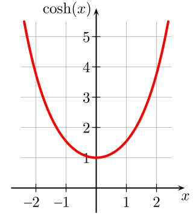

<!--

author:   André Dietrich, Sebastian Zug
email:    andre.dietrich@ovgu.de, sebastian.zug@ovgu.de
version:  1.0.0
language: de
narrator: Deutsch Female

script:   https://cdn.rawgit.com/davidedc/Algebrite/master/dist/algebrite.bundle-for-browser.js

script: https://cdn.jsdelivr.net/chartist.js/latest/chartist.min.js

link: https://cdn.jsdelivr.net/chartist.js/latest/chartist.min.css

@eval:    <script> Algebrite.run(`@input`) </script>


link:     https://pannellum.org/css/style.css
          https://cdn.pannellum.org/2.4/pannellum.css

script:   https://cdn.pannellum.org/2.4/pannellum.js

@panorama
<div id="panorama_@0" style="width: 100%; height: 400px;"></div>

<script>
  pannellum.viewer('panorama_@0', {
        "type": "equirectangular",
        "panorama": "@1",
        "autoLoad": true,
        "hotSpots": [@2]
  });
</script>
@end


@panorama_hotspots
<div id="panorama_@0" style="width: 100%; height: 400px;"></div>

<script>
  pannellum.viewer('panorama_@0', {
        "type": "equirectangular",
        "panorama": "@1",
        "hotSpotDebug": true,
        "autoLoad": true,
        "hotSpots": []
  });
</script>
@end


-->

# Netzwerktreffen 2018

Demo: Netzwerktreffen Hochschulforum Digitalisierung 2018


https://LiaScript.github.io

Kurs auf Github: https://github.com/liaScript/Netzwerktreffen2018

Kurs auf LiaScript: https://liascript.github.io/course/?https://raw.githubusercontent.com/liaScript/Netzwerktreffen2018/master/README.md#1

Autorenliste

| Name                    | Hochschule/Einrichtung |
|:------------------------|:-----------------------|
| Andre Dietrich          | OVGU Magdeburg         |
| Sebastian Zug           | OVGU Magdeburg         |

## Einleitung

Dieser Workshop stellt einige der Features von LiaScript im Rahmen des Netzwerktreffens "Hochschulforum Digitalisierung" vor.

## Das eLab Projekt

<!--
class = "animated rollIn"
style = "animation-delay: 2s;
         color: purple;
         -webkit-filter: blur(5px);
         " -->
!?[YouTube](https://www.youtube.com/embed/bICfKRyKTwE)

## Algebrite

http://algebrite.org/

```
100!
```
@eval

```
factor(100!)
```
@eval

```
simplify(cos(x)^2 + sin(x)^2)
simplify(a*b+a*c)
simplify(n!/(n+1)!)
```
@eval


## Bilder



## ASCII - Art


      |              *
    y |             *   
    - |
    A |            *   *
    c |  r           r          r
    h |           *     *
    s |          *       *
    e |        *           *
      |  * *                   * *
      +---------------------------
      0         x-axis         100

## Javascript

https://gionkunz.github.io/chartist-js/

```yaml
{
  labels: [1, 2, 3, 4, 5, 6, 7, 8],
  series: [
    [1, 2, 3, 1, -2, 0, 1, 0],
    [-2, -1, -2, -1, -2.5, -1, -2, -1],
    [0, 0, 0, 1, 2, 2.5, 2, 1],
    [2.5, 2, 1, 0.5, 1, 0.5, -1, -2.5]
  ]
}
```
<script>
new Chartist.Line('#chart', @input, {
  high: 3,
  low: -3,
  showArea: true,
  showLine: false,
  showPoint: false,
  fullWidth: true,
  axisX: {
    showLabel: false,
    showGrid: false
  }
});
</script>

<div class="ct-chart ct-golden-section" id="chart"></div>


## Effekte

               --{{0 French Female}}--
Hallo dies ist eine kleine Einführung in die Nutzung von Effekten.

      --{{1}}--
Punkt 1 ist eine Tabelle.

           {{1-4}}
| Header 1   | Header 2   |
| :--------- | :--------- |
| Item 1     | {3}{Item 2}     |


        --{{2 Australian Male}}--
This is an Textblock example.


   {{2}}
+ block
+ block
+ block

## Quizze

Was kommt hier rein.

  [[solution]]

Was ist die einzige Möglichkeit?

    [( )] This is XXX.
    [(X)] The only correct option.
    [( )] Still not right.
    [( )] Auch nicht richtig.
    [[?]] *enter your hint*
    [[?]] hilfe 2
    ****************************************

    Add a solution explanation __Markdown__!

    ****************************************


## 360

@panorama(simple image,https://pannellum.org/images/cerro-toco-0.jpg,{})
